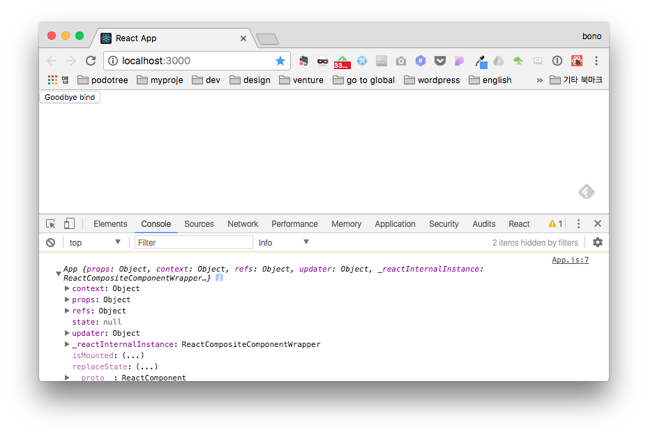
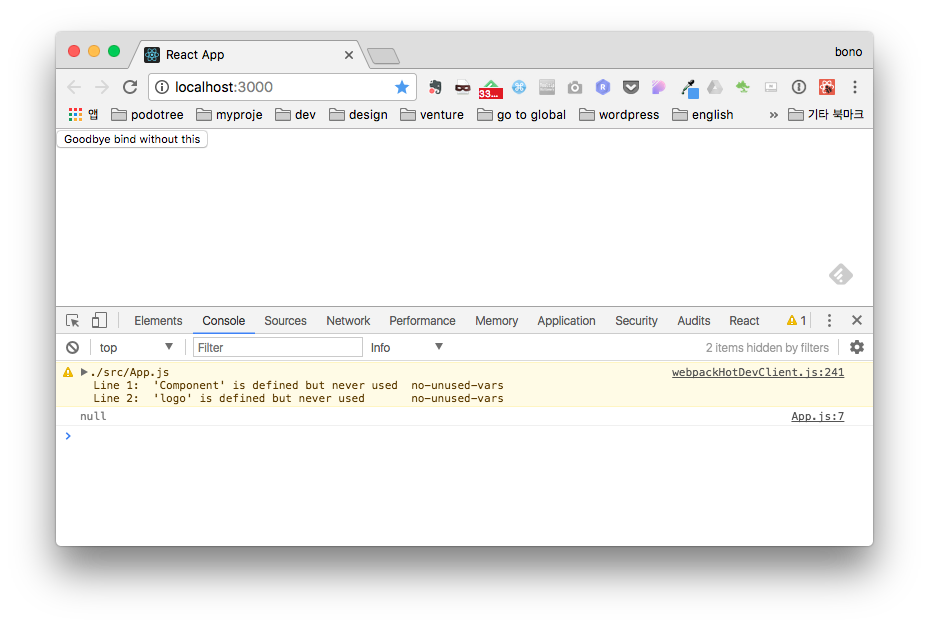

리액트를 개발하다보면 이런 코드를 본적 있을것입니다.

```jsx
this.someFunction.bind(this)
```

this(아마도 react 클래스 객체)에 속한 어떤 메서드를 다시 this 에 bind 한다라?? 굳이 왜 이런짓을 해야하는지 의문이 들만합니다.

리액트에서 이러한 코드가 빈번하게 작성되는 이유를 알기 위해서 우선 `bind()`가 무슨 역할을 하는지부터 알아보겠습니다.

#### bind()

bind 함수는 바인드하는 함수에서 사용하는 `this`의 대상을 지정해주는 역할을 합니다. 잘 사용하지 않아서 그렇지 그다지 어려운 개념은 아닙니다.

```javascript
const objA = {
  name: 'a',
  aFunc: function() {
    console.log(this.name)
  },
}

const objB = {
  name: 'b',
}

objA.aFunc() // (1)
// a
objA.aFunc.bind(objB) // (2)
const foo = objA.aFunc.bind(objB) // (3)
foo()
4
// b
```

`objA`와 `objB`라는 객체가 있습니다. objA 객체는 `name`이라는 값과 `aFunc`라는 함수를 속성으로 가지고 있습니다. 반면 objB 객체는 `name`이라는 값만 가지고 있죠.

(1) objA 의 aFunc 함수를 실행하면 예상대로 `a`가 출력됩니다.

(2) objA 객체의 aFunc 함수에서 bind(objB)를 호출합니다. 함수가 호출되었지만, 아무것도 출력되지 않죠. 다만, 원본 aFunc 함수와 동일한 기능을 하는 바인딩된 새로운 함수가 만들어집니다. 이때, bind 메서드에 전해진 인자는 복사된 바인딩 함수의 this 로 전달됩니다. 즉, aFunc 함수내의 `this`가 `objB`가 되는 것이죠. 이게 `bind()함수`가 하는 일의 전부입니다.

(3) 바인드 함수를 변수에 할당합니다.

(4) 실행하면 `b`가 출력됩니다.

### React 에서의 bind()

처음 잠깐 살펴보았지만, 리액트에서 bind()함수는 다음과 같이 사용됩니다.

```jsx
import React from 'react'

class BindTest extends React.Component {
  handleClick() {
    console.log(this)
  }
  render() {
    return (
      <button type="button" onClick={this.handleClick.bind(this)}>
        Goodbye bind
      </button>
    )
  }
}
export default BindTest
```

간단한 React 컴포넌트입니다. 버튼을 클릭하면 `this`에 해당하는 정보가 출력됩니다.



버튼 태그의 onClick 속성을 보면 bind() 함수가 사용되고 있는걸 알수 있습니다. 근데 좀 이상합니다. this 의 handleClick 함수에다가 this 객체를 바인드시켰습니다. 같은 this 인데 굳이 또 바인드해주는 이유가 뭘까요? bind 함수를 빼보겠습니다.

```jsx
import React from 'react'

class WithoutBindTest extends React.Component {
  handleClick() {
    console.log(this)
  }
  render() {
    return (
      <button type="button" onClick={this.handleClick}>
        Goodbye bind without this
      </button>
    )
  }
}
export default WithoutBindTest
```

어떤 결과가 나올까요?



`null`이 출력되었습니다. 왜 null 이 출력되었을까요?

이 내용을 이해하려면 자바스크립트에서의 `this`에 대해 어느정도 알고 있어야 합니다.

### this

객체지향 언어에서의 일반적인 this 의 의미(현재 객체를 지칭)와는 달리 자바스크립트의 this 는 실행시의 context 를 말하죠. 아래 예제를 보면,

```javascript
const thisTest = function() {
  console.log(this.value)
}
thisTest.value = 'I am this'
thisTest()
```

`"I am this"`가 나올거라는 예상과는 달리 `undefined`가 출력됩니다. 왜냐하면 `thisTest()`가 출력될 때의 context 가 전역객체이기 때문입니다. thisTest.value 는 thisTest 에 속성인데 전역객체에서 value 를 찾으려고 하니 undefined 가 나올수 밖에 없습니다(window 객체가 아니라 undefined 인 이유는 React 가 기본적으로 strict 모드에서 실행되기 때문입니다).

"I am this"를 출력하려면, this 에 해당하는 객체의 메서드를 호출하면 this.value 값을 가져올 수 있습니다. 아래 예제를 보면,

```javascript
const thisTest = function() {
  console.log(this.value)
}
thisTest.value = 'I am this'
thisTest.func = function() {
  console.log(this.value)
}
thisTest.func()
```

`thisTest.func` 함수를 만들어서 그안에서 `this.value`를 출력합니다. thisTest 객체의 func() 메서드를 호출하면 이 때는 `this`가 thisTest 가 되기 때문에 정상적으로 this.value 를 가져와 "I am this"를 출력합니다.

이제, 리액트로 다시 돌아가보죠.

### React 에서의 this

WithoutBindTest 클래스의 render() 함수를 다시 살펴보겠습니다.

```jsx
render() {
    return <button type="button" onClick={this.handleClick}>Goodbye bind without this</button>;
}
```

컴포넌트의 render()함수가 실행되면 DOM 이 그려질것입니다. 이때 this 는 WithoutBindTest 객체를 가리키는것이 맞습니다. 하지만 handleClick()함수가 호출될때의 this 는 WithoutBindTest 가 아닌 전역객체(Window)를 의미합니다. 왜냐하면 this 라는 값은 호출하는 문맥(context)에의해 좌우되는데 클릭이 실행되는 문맥이 바로 전역(window)객체이기 때문이죠.

### Arrow Function

click, change 등의 이벤트 리스너를 붙여줄때마다 `bind()`함수를 작성하는건 귀찮은 일입니다. ES6 의 `화살표함수`를 사용하면 이 문제를 간단히 해결할 수 있습니다. BindTest 를 화살표 함수를 이용해 새로 작성해보았습니다.

```jsx
import React from 'react'

class BindTest extends React.Component {
  handleClick = () => {
    console.log(this)
  }
  render() {
    return (
      <button type="button" onClick={this.handleClick}>
        Goodbye bind
      </button>
    )
  }
}
export default BindTest
```

이제는 this 가 무엇인지 걱정할 필요가 없습니다. 화살표 함수의 this 는 외부함수(부모함수)의 this 를 상속받기 때문에 this 는 항상 일정합니다. 위 예제의 경우에는 BindTest 클래스(사실 함수입니다)가 되겠죠.

### 결론

> bind()함수는 전달된 인자를 this 로 보내는 바인딩 함수를 만듭니다.
> this 는 다른 언어와 달리 실행 문맥(context)에 따라 변합니다.
> React 에서 이벤트 핸들러 함수를 바인드할때 화살표 함수를 사용합니다.
