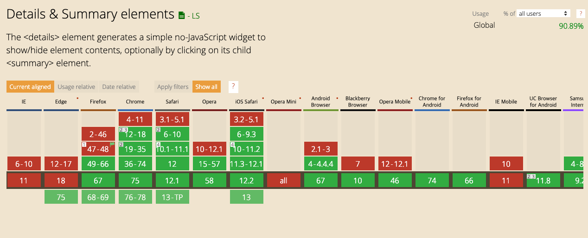

공지사항이나 FAQ 페이지에는 `expandble리스트`가 많이 사용된다. `collapsible`이라고도 하는데, 기본적인 리스트에서 각 항목을 터치(클릭)하면 세부 내용이 확장되는 형태의 UI다. 비교적 간단한 UI기 때문에 css와 javscript를 적절히 조합하면 누구나 손쉽게(feat. google) 만들수 있다. 하지만 간혹 자바스크립트 없는 pure한 HTML(with CSS)이 필요한 경우가 있다. javascript가 잘 동작하지 않는 브라우저거나, 유저가 아예 javascript 기능을 꺼버렸다면(도대체 왜??) pure한 HTML이 빛을 발하게 된다. 사실, 그냥 내가 이전부터 하고 싶었다.

구글에 expandable(collapsible) list라고 검색을 해보면 2가지 방법이 등장하는데, 대부분은 input태그를 이용한 일종의 꼼수다. 그리고 두번째는 비교적 최신 스펙인 = `details`와 `summary` 태그를 이용한 방법이다. 하나씩 살펴보자.

### 1. input 태그를 이용하자.

input 태그를 이용하는 방법의 핵심은 보이지 않는(display: none) input태그(type="checkbok" 또는 type="radio")와 label을 이용하는 것이다. input에 id를 부여하고 label의 `for` 속성에 input의 id를 동일하게 넣어주면, label을 터치했을때 input의 check 상태를 변경할수 있다. 코드를 보자.

~~~html

  <input type="checkbox" class="checkbox" id="expandable-input" />
  <label for="expandable-input" class="title">제목입니다.</label>
  

    Lorem ipsum dolor, sit amet consectetur adipisicing elit. Quidem 
    quam alias veritatis esse deserunt veniam explicabo sunt eligendi,
    eaque perferendis, doloremque omnis delectus distinctio incidunt
    adipisci. Sit distinctio vero dolore.
  

~~~

  
  

    <input type="checkbox" class="checkbox" id="expandable-input" />
    <label for="expandable-input" class="title">제목입니다.</label>
    

      Lorem ipsum dolor, sit amet consectetur adipisicing elit. Quidem 
      quam alias veritatis esse deserunt veniam explicabo sunt eligendi,
      eaque perferendis, doloremque omnis delectus distinctio incidunt
      adipisci. Sit distinctio vero dolore.
    

  

매우 간단하다. 어려울것도 없다. 우선 input 태그는 가려준다. 그리고 label을 클릭하면 input 태그의 check 상태가 바뀐다. unchecked일때는 `max-height이 0px`이다. 그리고 checked 상태가 되면, desc의 `max-height을 변경`한다. height이 아닌 max-height을 사용한 이유는 고정된 height를 사용하지 않음으로써 content의 높이에 따라 영역이 설정되도록 만들기 위함이다. 또다른 이유는 transition을 적용하기 위함이다. 위에서 아래로 내려오는 효과를 줄때 height이나 max-height을 적절히 사용하면 간단히 구현가능하다.  

ul과 li를 사용하고, 약간의 스타일과 transition 적용해보았다. 

<iframe src="https://codesandbox.io/embed/expandable-list-by-pure-css-kw5b3?fontsize=14" title="expandable list by pure css " allow="geolocation; microphone; camera; midi; vr; accelerometer; gyroscope; payment; ambient-light-sensor; encrypted-media" style="width:100%; height:500px; border:0; border-radius: 4px; overflow:hidden;" sandbox="allow-modals allow-forms allow-popups allow-scripts allow-same-origin"></iframe>

테스트해보면 각각의 row가 잘 펼쳐지고 접힌다. 그런데, 한가지 아쉽다. 한 row를 펼쳤을때 다른 row가 접히는 구조면 더 나을것 같다. 실제로 그렇게 구현된 페이지들도 꽤 많다. CSS만으로 가능할까? checkbox 대신 `radio`를 사용하면 가능하다.

위에서 작성한 list 코드에서 CSS는 변경할게 없다. HTML만 조금 수정해두면 된다. 우선 첫번째 li에 있는 input 태그에 `checked` 속성을 부여한다. 그러면 처음 렌더링 될때 열리게 될것이다. 그리고 각각의 input에 type을 checkbox에서 `radio`로 변경한다. 그리고 같은 radio 그룹으로 묶이기 위해 `동일한 name`을 부여한다. 그럼 끝이다. 

<iframe src="https://codesandbox.io/embed/expandable-list-by-pure-css-fddyd?fontsize=14" title="expandable list by pure css" allow="geolocation; microphone; camera; midi; vr; accelerometer; gyroscope; payment; ambient-light-sensor; encrypted-media" style="width:100%; height:500px; border:0; border-radius: 4px; overflow:hidden;" sandbox="allow-modals allow-forms allow-popups allow-scripts allow-same-origin"></iframe>

### 2. details & summary

`details`와 `summary` 태그를 이용하면 위에서 구현한 것과 비슷한 형태의 UI를 만들수 있다. details와 summary는 비교적 최신 스펙이기 때문에 모든 브라우저에서 사용가능한것은 아니다. IE나 최신 edge에서는 아직 사용할 수 없다.

브라우저 호환성 이외에도 transition이나 animation이 제대로 적용되지 않는 문제가 있다. 적용되긴 하더라도 위에서 보여줬던 UI보다도 퀄리티가 한참 떨어져보인다. 우선 간단한 사용법을 알아보자.

~~~html

  

    제목입니다.
  

  

    Lorem ipsum dolor, sit amet consectetur adipisicing elit. Quidem 
    quam alias veritatis esse deserunt veniam explicabo sunt eligendi,
    eaque perferendis, doloremque omnis delectus distinctio incidunt
    adipisci. Sit distinctio vero dolore.
  

~~~

  
  

    

      제목입니다.
    

    

      Lorem ipsum dolor, sit amet consectetur adipisicing elit. Quidem 
      quam alias veritatis esse deserunt veniam explicabo sunt eligendi,
      eaque perferendis, doloremque omnis delectus distinctio incidunt
      adipisci. Sit distinctio vero dolore.
    

  

1번에서 보았던 방법보다 훨씬 코드가 간단하다. 심지어 필요한 CSS는 단 1줄도 필요없다(.title은 잘 보이게 하려고 넣은것). details안에 제목으로 사용될 summary를 넣고 그 아래에다가 상세정보를 넣으면 된다. p코드를 썼지만, div나 span을 써도 무방하다. 

이번에는 위에서 작업했던것과 동일하게 list를 만들어보았다.

<iframe src="https://codesandbox.io/embed/expandable-list-by-details-and-summary-gyn1n?fontsize=14" title="expandable list by details and summary" allow="geolocation; microphone; camera; midi; vr; accelerometer; gyroscope; payment; ambient-light-sensor; encrypted-media" style="width:100%; height:500px; border:0; border-radius: 4px; overflow:hidden;" sandbox="allow-modals allow-forms allow-popups allow-scripts allow-same-origin"></iframe>

details에는 `open`이라는 속성이 존재하는데, 터치(클릭)을 하게되면 open이 참이 된다. 트랜지션을 발생시키기 위해 open 속성을 이용하여 아래처럼 CSS를 작성하였다. 트랜지션이 발생하긴 하지만 상세 설명 부분이 사라지는 타이밍과 맞지 않아 뭔가 어색한 느낌이다.

~~~css
details {
  transition: height 1s;
}
details:not([open]) {
  height: 40px;
}
details[open] {
  height: 200px;
}
~~~

코드를 보면 이상한점이 두가지가 있다. 첫째, 1번에서처럼 `max-height`을 사용하지 않고 height을 사용했다. 이유는 max-height을 사용하면 transition이 전혀 발생하지 않기 때문이다. 둘째, 펼쳐지는 대상은 details 내부에 `div`인데 detail에 transition을 주었다. 이는 details를 사용할때 transition을 주기 위해서는 details에 넣어야만 동작하기 때문이다(최신 크롬에서 테스트 해보았다). 그래서 open되지 않았을때 row 높이인 40px을 주었고, open일때는 적절한 값(200px)을 주었다. 

또 한가지 details를 사용하면 기본적으로 좌측에 삼각형 이미지가 생긴다. 닫힌 상태일때는 오른쪽 방향 삼각형이고 open 상태일때는 아래로 향하는 삼각형이 된다. MDN web docs 사이트에 나온 설명을 읽어보면, summary에 `list-style: none` 속성을 부여하면 icon을 없앨 수 있다고 하는데, webkit 기반의 chrome 브라우저에서는 제대로 icon이 사라지지 않는다. 그래서 아래 코드를 넣어줘야 icon을 없앨 수 있다.

~~~css
details > summary::-webkit-details-marker {
  display: none;
}
~~~

### 결론
두 가지 방법 모두 완벽하지는 않다. javascript를 이용했을때에 비해 확실히 제약이 있다. radio 타입의 input 태그를 사용할때 펼쳐져 있는 자기 자신을 클릭했을때 접혀지지 않는 문제가 있다. 그리고 두번째 details와 summary 태그는 비교적 최신 스펙이기 때문에 제한된 브라우저에서만 지원된다. 그리고 몇가지 속성은 최신 크롬에서도 `-webkit-` prefix를 붙여줘야만 제대로 적용된다. 그만큼 아직까지는 실제 서비스에서 사용하기는 무리란 얘기다. 

### 참고자료
- [detail태그 애니메이션 테스트](https://codepen.io/morewry/pen/gbJvy)
- [MDN web docs: details](https://developer.mozilla.org/en-US/docs/Web/HTML/Element/details)