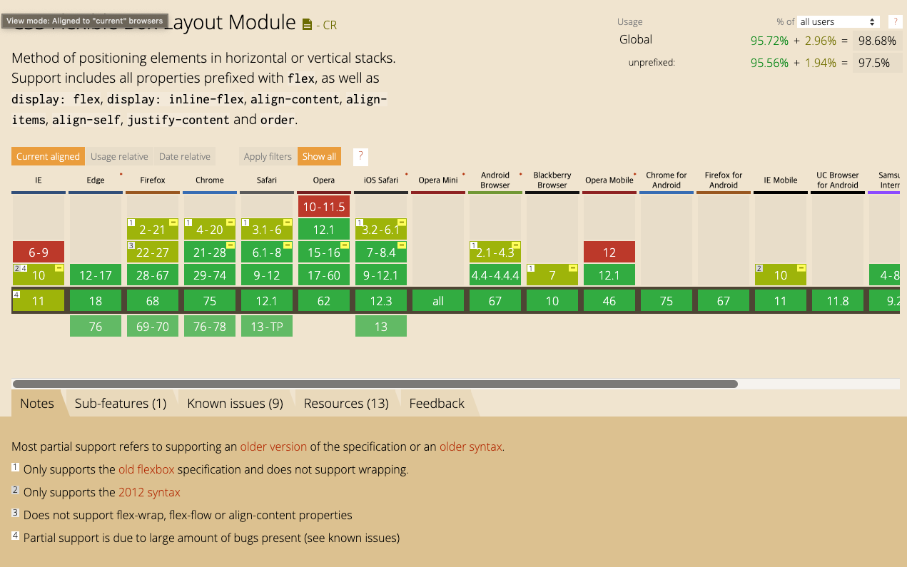
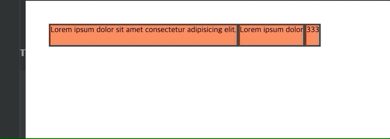

그 동안 `flexbox`로 작업하면서 배운것들에 대해 알아보자. 


## flexbox의 기초

flexbox의 기초를 다룬 좋은 글이 많기 때문에 여기서 다시 다룰 필요는 없을것 같다. 만약 flexbox에 대해 잘모르거나 잘 생각나지 않는분들이라면 아래 링크를 한번씩 읽어보기 바란다.

> - [Flexbox in MDN Web Doc](https://developer.mozilla.org/ko/docs/Web/CSS/CSS_Flexible_Box_Layout/Flexbox%EC%9D%98_%EA%B8%B0%EB%B3%B8_%EA%B0%9C%EB%85%90)
> - [A guide to flexbox in css-tricks](https://css-tricks.com/snippets/css/a-guide-to-flexbox/)
> - [CSS Flex 완벽 가이드 in Heropy tech 블로그](https://heropy.blog/2018/11/24/css-flexible-box/)
> - [flexbox로 만들 수 있는 10가지 레이아웃 in 네이버 d2 블로그](https://d2.naver.com/helloworld/8540176)
 

## flexbox in IE

웹 개발자라면 아마도, IE 대응은 웬만하면 피하고 싶을것이다. 전 세계적으로 IE 사용은 점점 없어지는 추세지만, 한국에서는 여전히 20% 정도가 사용중이다. 업데이트가 중지된지도 오래됐지만(더이상의 보안 업데이트가 없다!!), 많은 관공서 홈페이지가 여전히 IE에서만 동작하기 때문에 한국에서는 아예 배재할 수 없는게 현실이다.

그런데, 예상밖으로(?) IE에도 Flexbox를 지원한다. IE10에서는 일부 [스펙](https://www.w3.org/TR/2012/WD-css3-flexbox-20120322/)만 지원하고 IE11에서는 대부분 지원한다. 그렇다고 기뻐하지는 말자. 그 악명높은 `IE`다. `flexbox로 IE 대응`을 해본 사람만 알겠지만, 셀 수 없이 많은 버그가 당신을 괴롭힐 수 있다.



<p align="center">
<a target="_blank" rel="noopener noreferrer" href="https://caniuse.com/#feat=details">flexbox 브라우저 호환성 확인하기</a>
</p>

`caniuse`의 flexbox 항목이다. 아래 `Notes`의 4번 항목(IE10, IE11에 해당)을 보자. 

> Partial support is due to large amount of bugs present
> 엄청나게 많은 버그 때문에 일부만 지원한다

얼마나 많은 버그가 있길래 저렇게 써놨을까... 심지어 flexbox의 버그(대부분 IE 버그)를 모아놓은 [깃헙 프로젝트(flexbugs)](https://github.com/philipwalton/flexbugs)도 있다. 다양한 버그들이 존재하지만, 대표적으로 기본값이 다른 버그가 있다. flex를 사용할때는 축약형을 많이 쓰는데, `flex: 1;`을 풀어쓰면 다음과 같다. => `flex: 1 1 auto`(이게 뭘 의미하는지 잘 모르겠다면 맨 위 기초 포스팅을 다시 읽어보자)

각 축약형은 다음과 같이 쓰인다. 
```
# 아무것도 안쓰면;
=> flex: 0 1 auto;

# flex: 1; 
=> flex: 1 1 0%;

# flex: auto;
=> flex: 1 1 auto;

# flex: initial;
=> flex: 0 1 auto
```

그런데, IE에서는 조금 다르다.

```
# 아무것도 안쓰면;
=> flex: 0 0 auto;

# flex: 1; 
=> flex: 1 0 0px;

# flex: auto;
=> flex: 1 0 auto;

# flex: initial;
=> flex: 0 0 auto
```

주로 `shrink` 부분(축양형에서 두번째 값)이 1과 0으로 다르다. `flex item에 아무것도 입력하지 않았을때`를 생각해보자. 아무것도 입력하지 않았기 때문에 `flex: 0 1 auto;`가 적용될것이다. 이는 스크린이 커져도 확장하지 않고(0), 스크린이 작아지면 줄어들고(1), 컨텐츠의 크기로 너비(또는 높이)를 결정한다는 뜻이다. 아래 코드를 살펴보자.

```html
<style>
  .container {
    display: flex;
    padding: 50px;
  }
  .box {
    text-align: center;
    height: 50px;
    font-size: 20px;
    background: coral;
    border: 4px solid #333333;
  }
</style>
<div class="container">
  <div class="box">
    Lorem ipsum dolor sit amet consectetur adipisicing elit.
  </div>
  <div class="box">Lorem ipsum dolor</div>
  <div class="box">333</div>
</div>
```

이 코드는 정상적인 경우와 IE10에서 각각 아래처럼 동작한다.

#### 정상적인 상황


#### IE10


이 버그 외에도 flexbugs 프로젝트를 보면 너무도 많은 버그들이 존재함을 알 수 있다. 그러니 괜히 어설프게 flexbox로 IE를 지원하려고 했다가는 오히려 프로젝트를 다시 만들어야하는(flexbox가 아닌 방식으로) 상황이 생길 수 있으니 주의해야한다.


## ilnine-flex

일을 하면서 `display: inline-flex`를 사용한적은 거의 없다. 왜냐하면 굳이 inline-flex가 아니더라도 `display: flex` 하나면 웬만한 레이아웃은 충분히 만들수 있기 때문이다. inline-flex는 이름에서도 알 수 있듯이 flex 를 inline 요소로 다루겠다는 의미다. 주의할점은, inline으로 다루는 대상이 flex container지 item이 아니다. 상식적으로 inline(inline-block에 더 가깝다)이라는 속성이 block 요소를 수평으로 쌓기 위함인데, flex item은 direction으로 수평 쌓기가 가능하므로 inline 속성이 굳이 필요없다. 

그럼, flex와 inline-flex가 다르게 동작하는 몇가지 상황을 살펴보자. inline 속성만 잘 이해하고 있다면 이해하기 쉬울것이다.

<div class="frame-wrap">
<iframe src="https://codesandbox.io/embed/inline-flex-wbo3r?fontsize=14&view=preview" title="inline-flex" allow="geolocation; microphone; camera; midi; vr; accelerometer; gyroscope; payment; ambient-light-sensor; encrypted-media" style="width:100%; height:500px; border:0; border-radius: 4px; overflow:hidden;" sandbox="allow-modals allow-forms allow-popups allow-scripts allow-same-origin"></iframe>
</div>
<p align="center">[가급적 PC에서 확인하자]</p>


순서대로 하나씩 설명해보면,

### 두개의 컨테이너
block 속성은 스크린 전체 너비를 차지하고, inline 속성은 자기 자신의 크기에 따라 너비가 결정된다. 그래서 flex일때는 수직으로 쌓이고, inline-flex일때는 수평으로 충분하 공간이 있으면 수평으로 쌓인다(스크린이 충분히 작으면 수직으로 쌓이는것처럼 보일수도 있다).

### item에 기본값 적용
flex item에 아무것도 입력하지 않았을때는 `flex: 0 1 auto`이므로, item 자신의 너비를 가진다. shrink가 `0`이지만 basis가 `auto`라서 사실상 스크린 사이즈가 줄어도 item이 줄어들지 않는다(flex-grow와 flex-shrink는 basis를 제외한 여백의 늘어남과 줄어듬을 의미한다).

### item에 "flex: 1" 적용
`flex: 1`은 `flex: 1 0 0%`와 같다. 즉, basis가 0이고 확장하는 성격을 가진다. 그래서 flex에서는 각 item이 동일한 너비를 가진다. 그런데, inline-flex에서는 item들이 동일한 너비를 가지긴 하는데, 전체 사이즈가 좀 애매하다. 이유는 inline-flex 컨테이너의 사이즈가 각 item 너비의 합으로 결정되기 때문이다. 자세히 살펴보면 위의 `item에 기본값 적용`과 같은 너비를 가짐을 알 수 있다. 

### flex-basis vs width 
두개의 차이가 뭘까? flex-basis가 컨텐츠의 너비를 결정하는것은 아니다. 너비는 width가 결정한다. 단, flex-basis는 다른 flex 속성(flex-grow, flex-shrink)을 결정할때 기본(basis)가 되는 값이다. 스크린 너비 전체를 차지하는 flex의 경우에는 대개의 경우 width와 flex-basis가 동일한 결과를 보여줄것이다. 하지만, inline-flex의 경우에는 좀 다르다. flex-basis에 특정 값(ex. 200px)을 넣어준것과 width에 특정값을 넣어준것과 차이를 보인다. flex-basis에 특정 값을 넣으면 컨테이너 너비는 변함없지마 item의 총합이 컨테이너보다 길어져 `scroll`이 발생한다. width에 특정 값이 들어갔을때는 컨테이너 너비에 그대로 반영되기 때문에 width의 값만큼 컨테이너도 늘어난다.

## flexbox로 응용할수 있는 레이아웃

flexbox를 활용하면 이전 방식으로 만들기 어려웠던 다양한 레이아웃을 훨씬 쉽게(?) 만들 수 있다.

### 반응형에 최적화된 컨텐츠 리스트

<div class="frame-wrap">
<iframe src="https://codesandbox.io/embed/flex-content-row-qdedu?fontsize=14" title="flex-content-row" allow="geolocation; microphone; camera; midi; vr; accelerometer; gyroscope; payment; ambient-light-sensor; encrypted-media" style="width:100%; height:500px; border:0; border-radius: 4px; overflow:hidden;" sandbox="allow-modals allow-forms allow-popups allow-scripts allow-same-origin"></iframe>
</div>
<p align="center">[반응형 확인을 위해, PC에서 새창을 열어 확인하자]</p>

컨텐츠 서비스에서 많이 보이는 형태의 레이아웃이다. 컨텐츠 리스트나 컨텐츠의 에피소드 리스트에서 주로 쓰인다. 보통은 컨텐츠가 하나가 한줄을 차지하지만, media query를 사용해 800px이 넘어가면 두 컨텐츠가 한줄을 차지하도록 구성해보았다.


### 넷플릭스처럼 가로로 콘텐츠가 나열된 레이아웃

<div class="frame-wrap">
<iframe src="https://codesandbox.io/embed/flexbox-test-o8qxr?fontsize=14" title="netflix-flexbox" allow="geolocation; microphone; camera; midi; vr; accelerometer; gyroscope; payment; ambient-light-sensor; encrypted-media" style="width:100%; height:500px; border:0; border-radius: 4px; overflow:hidden;" sandbox="allow-modals allow-forms allow-popups allow-scripts allow-same-origin"></iframe>
</div>
<p align="center">[hover가 동작해야하므로, PC에서 확인하자]</p>

넷플릭스를 보면 가로로 길게 컨텐츠가 나열되어 있고, 각 컨텐츠에 마우스가 `hover`되면 컨텐츠가 확대된다. 이는 flex-grow의 비율로 어렵지않게 구현할수 있다. 

### 가로로 스크롤되는 vertical masonry 레이아웃

<div class="frame-wrap">
<iframe src="https://codesandbox.io/embed/flamboyant-franklin-phv46?fontsize=14" title="flamboyant-franklin-phv46" allow="geolocation; microphone; camera; midi; vr; accelerometer; gyroscope; payment; ambient-light-sensor; encrypted-media" style="width:100%; height:500px; border:0; border-radius: 4px; overflow:hidden;" sandbox="allow-modals allow-forms allow-popups allow-scripts allow-same-origin"></iframe>
</div>

[Pinterest](https://www.pinterest.co.kr/)같은 서비스에서 흔히 보이는 형태의 레이아웃이다. 가로로 꽉차지 않도록 `inline-flex`를 사용했다. 각 컨텐츠의 높이가 다른 경우 유용하다. 하지만, 실제 Pinterest 같은 경우에는 flex를 사용하지 않는다. 그 이유는 API 통신을 통해 동적으로 가져온 컨텐츠를 이미 배치된 컨텐츠 바로 아래에 붙여야 하는데, 영역의 끝이 들쭉날쭉하기 때문에 컨텐츠마다 개별적인 배치가 필요하다. 그래서 `position: absolute`를 이용한다. 하지만 간단한 레이아웃이라면 예제처럼 flexbox로 구현해도 문제없다. 


## 결론
flexbox 기초 자료를 보면 알겠지만, 매우 직관적이고 러닝커브가 낮다. 그래서 누구나 쉽고 빠르게 사용할 수 있다. 하지만, IE를 대응해야 한다면 얘기가 달라진다. 알 수 없는 이유로 레이아웃이 깨지는 경우를 수없이 목격할 것이고 이내 지쳐버릴지도 모른다. 그러니 IE가 반드시 필요하다면 flexbox 도입은 다시 생각해보자. flexbox는 심플하고 직관적이지만 매우 유연하다. 그래서 아이디어만 있다면 그 가능성은 무궁무진하다. 