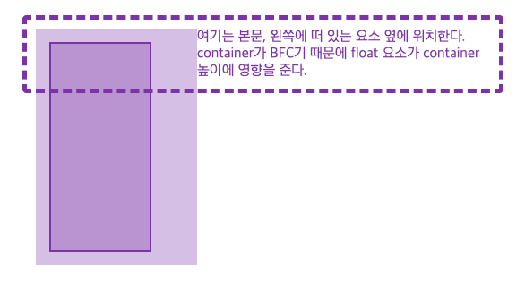
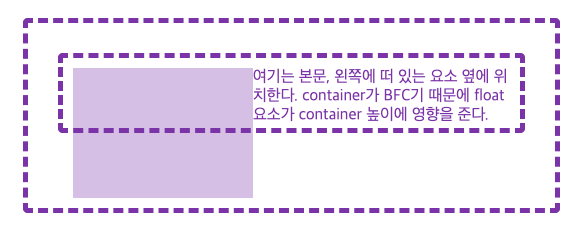
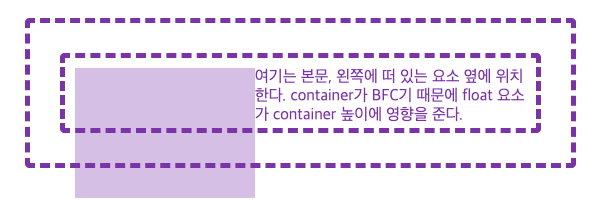

프론트엔드 개발에서 Block Formatting Context(이하 BFC)라는 용어는 그리 자주 사용하지 않는다. 아예 들어본 적 없는 사람도 많을 것 같다. 그러나, BFC는 용어에 비해 어렵지 않다(용어가 많아 조금 헷갈리긴 하다). 누구나 이해할 수 있는 수준이다. 한 번이라도 HTML과 CSS로 layout을 작성해본 사람이라면 이미 경험적으로 알고 있는 내용이다. 하지만, 경험적으로 어렴풋이 아는 것과 용어와 동작 방식을 바로 아는 것은 차이가 있다. BFC가 무엇이고, 어떻게 동작하는지 살펴보자.

`
`태그를 하나 만들자.

~~~HTML

block

~~~

하나의 block 레벨 요소(BFC가 아님에 주의)가 생성되었다. 최상위 block에 `.container` 클래스를 붙여주자. 그리고 자식 요소를 몇 개 만들어 보자.

~~~HTML

  

    나는 왼쪽에 떠 있다.
  

  여기는 본문, 왼쪽에 떠 있는 요소 오른쪽에 위치한다. 떠 있는 요소의 영향을 받지만, 나만이 container의 높이를 결정한다.

~~~

아마 이 상황을 겪어 봤겠지만, `.float-left` 영역이 container를 벗어난다(그렇지 않다면, viewport 너비를 조정해보자). block 레벨 요소(container)가 float 된 자식 요소를 포함하지 않기 때문에 발생한 현상이다. 

> 요즘은 `flexbox`나 `grid`를 많이 사용하기 때문에 `float`의 존재가 잊혀진 것 같다. flexbox와 grid는 float에 비해 직관적이고 명확해서 레이아웃 구성에 용이하다. 하지만, 불과 십 년 전만 하더라도 레이아웃 구성에 float를 사용했다. 지금도 많은 웹문서가 float를 사용한다. float를 사용해 레이아웃을 구성해 본 사람은 알겠지만, 쉽지 않고 복잡하다. 

`.container`에 `overflow: hidden`(auto도 마찬가지)을 넣어보자.

container에 `BFC(Block Formatting Context)`가 생성 되었다. 이제는 float 요소의 높이가 container의 높이에 영향을 준다. BFC는 그 안에 만들어진 모든 요소를 포함하기 때문이다. 사실 container를 BFC로 만들지 않더라도, `clearfix 방식`을 사용해서 처리 할 수 있다. 하지만, 이 방법은 float 요소를 포함하기 위해 불필요한 요소를 삽입하기 때문에 가독성이 좋지 않다. 

W3C에는 다음의 경우 BFC가 생성된다고 정의한다.

> Floats, absolutely positioned elements, inline-blocks, table-cells, table-captions, and elements with ‘overflow’ other than ‘visible’ (except when that value has been propagated to the viewport) establish new block formatting contexts.

정리하면 다음과 같다(몇 가지 추가, 자세한 내역은 [이 문서](https://developer.mozilla.org/en-US/docs/Web/Guide/CSS/Block_formatting_context)를 확인하자).

- html root 태그 (body 태그는 만들어지지 않는다)
- none을 제외한 float
- position: fixed, absolute
- display: inline-block, table, table-cell, table-caption
- overflow: visible을 제외한 모든 값
- display: flow-root (일부 브라우저만 동작함)
- display: flex, inline-flex, grid, inline-grid

BFC는 레이아웃 안의 작은 레이아웃이라고 생각하면 된다. BFC 내부의 모든 요소는 이 블록 안에 속한다. 내부 요소가 float 상태라 하더라도 마찬가지다. 그래서 container에 `overflow: hidden;` 속성을 부여하면 float 요소는 container 높이에 영향을 준다. 

-----------------------------------------------

## BFC의 특성

BFC의 몇 가지 특성에 대해 알아보자.

### float는 BFC를 생성한다

`float`는 BFC를 생성한다. 처음 예제에서 float-left의 높이 값을 제거하고 `inner` 요소를 추가했다.

~~~HTML

  
    
    

    

  

  여기는 본문, 왼쪽에 떠 있는 요소 옆에 위치한다. container가 BFC기 때문에 float 요소가 container 높이에 영향을 준다.

~~~

`.container`가 BFC가 아니므로 `.float-left`의 높이는 container 크기와 무관하다. 그러나 BFC 생성 규칙에 따라 float 요소는 BFC를 생성하므로 `.float-left` 요소는 BFC가 된다. 그래서 그 내부에 `.float-left.inner`는 `.float-left`의 높이에 영향을 준다. 

### BFC 자식의 자식은 어떻게 될까?

BFC container 안에 `non BFC container`를 넣고, 그 안에 float 요소를 배치한다. 비교를 위해 두 번째 container 요소의 높이를 `50px`로 고정한다.

~~~HTML

  

    

    

      여기는 본문, 왼쪽에 떠 있는 요소 옆에 위치한다. container가 BFC기 때문에 float 요소가 container 높이에 영향을 준다.
  

~~~

`.container.height-50` 요소는 non BFC다. 그래서 그 안의 float 요소를 포함하지 않는다. 하지만, 가장 상위 요소가 BFC이기 때문에 자식의 자식인 float 요소까지 포함한다. 즉, float 요소가 `.container.height-50`의 높이에 영향을 준다.

`.container.height-50`를 BFC로 변경해보자.

~~~HTML

  

    

    

      여기는 본문, 왼쪽에 떠 있는 요소 옆에 위치한다. container가 BFC기 때문에 float 요소가 container 높이에 영향을 준다.
  

~~~

BFC 내부에 BFC가 존재하면, 내부 BFC의 자식 요소의 크기는 표현하지 않는다. 그래서 `.container.height-50.BFC` 요소의 높이인 50px만 늘어나게 된다. 

### BFC는 margin collapse를 막는다.

margin collapse는 요소의 margin 값이 겹칠 경우, 값이 더 큰 margin만 적용되는 현상을 말한다. 

~~~HTML

  
paragraph 영역

  
paragraph 영역

~~~

container 영역이 non BFC기 때문에 div와 p 영역에 `margin collapse 현상`이 발생한다. margin은 background 영역에 포함되지 않기 때문에, 위아래가 회색으로 표현되지 않는다. 이때 가로 영역은 margin collapse가 발생하지 않음에 주의하자. 만약, div 영역에 `border`나 `padding` 값이 있다면, margin collapse 현상은 발생하지 않는다. 왜냐하면 div의 margin과 p의 margin 사이에 어떤 값이 존재하기 때문이다. 다시 한번 말하지만, margin collapse가 발생하기 위해서는 둘 사이에 아무것도(border, padding 포함) 없어야 한다. 

container가 BFC가 되면 어떨까?

~~~HTML

  
paragraph 영역

  
paragraph 영역

~~~

`BFC는 margin collapse를 방지`한다. 그래서 p와 div의 margin이 서로 상쇄되지 않는다. 

### display: flow-root

overflow뿐만 아니라, display의 여러 요소와 position의 fixed, absolute 속성으로도 BFC가 만들어진다. 하지만, BFC라는 개념과 앞서 나열한 여러 속성 간의 관계가 직관적이지 않다. 그리고 각 요소의 성격에 따라 예상치 못한 문제가 발생할 수 있다. 그래서 대안으로 `display: flow-root`라는 속성이 등장했다. 아직 일부 브라우저에서만 동작하지만, 직관적이고 예상치 못한 문제를 예방할 수 있다. 예를 들어, overflow 속성을 사용하여 BFC를 생성한 경우와 flow-root를 사용한 경우에는 결과물이 달라질 수 있다. 

  &#60; overflow를 사용해서 BFC를 만든 경우 &#62;

  &#60; display: flow-root를 사용해서 BFC를 만든 경우 &#62;

[Codepen](https://codepen.io/blueshw/pen/MWaPBym)에서 직접 테스트해 보자.

-----------------------------------------------

## 참고자료

- [MDN Block formatting context](https://developer.mozilla.org/en-US/docs/Web/Guide/CSS/Block_formatting_context)
- [MDN Visual Formatting Model](https://developer.mozilla.org/en-US/docs/Web/CSS/Visual_formatting_model)
- [Understanding CSS Layout And The Block Formatting Context](https://www.smashingmagazine.com/2017/12/understanding-css-layout-block-formatting-context/)
- [Understanding Block Formatting Contexts in CSS](https://www.sitepoint.com/understanding-block-formatting-contexts-in-css/)
