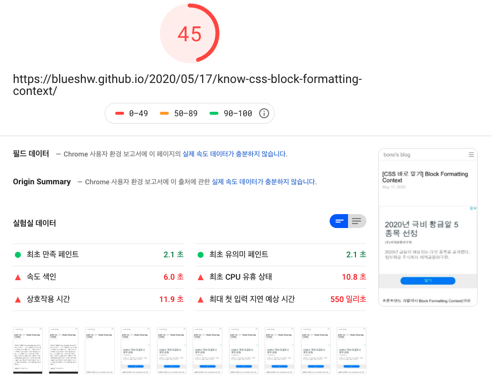
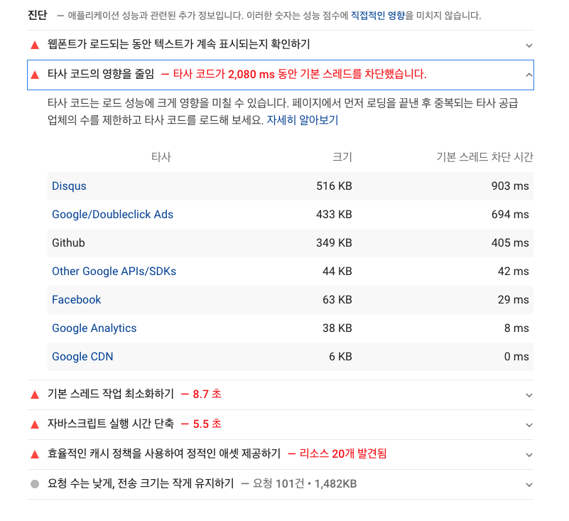

## disqus는 왜 이렇게 무거울까?

`구글 서치 콘솔(Google Search Console)`에서 내 블로그가 그리 빠르지 않다는 것을 발견했다. 

  &#60; url이 왜 118개 밖에 없을까?? 글은 150개쯤 되는데.. &#62;

`gatsby`를 사용하는 정적 페이지 사이트임에도 불구하고 빠른 페이지가 하나도 없다. 뭔가 이상하다. 혹시 몰라 [PageSpeed Insight](https://developers.google.com/speed/pagespeed/insights/)를 이용하여 퍼포먼스를 측정해보았다. 

`45점`은 너무 낮다. 데스크탑은 그나마 나은데(평균 90점 이상), 모바일은 생각 이하다. 정적 페이지라는 생각 때문인지 몰라도, 딱히 최적화 하는데 신경쓰지 않았다. 필요한게 있으면 계속 붙였다. 지금껏 한 페이지를 로딩하는데 5MB가 넘는 리소스를 다운 받고 있었다. SPA 기반이라 처음 로딩에 필요한 리소스가 많은 건 알겠다. 그렇다 하더라도 너무 많다. 다운 받은 리소스 중 이미지를 제외하고는 자바스크립트의 비중이 압도적이다. JS는 다운로드로 끝나는게 아니다. 코드를 평가하고 실행하는데도 시간이 필요하다. 이대로 두면 안될 것 같았다. 지금이라도 필요 없는 리소스를 제거하고 퍼포먼스를 높여야겠다.

## disqus를 지우자

내가 할 수 있는 부분이 뭐가 있나 확인해보았다. 항목 중에서 `타사 코드의 영향을 줄임`이 눈에 띄었다. 타사 코드란 웹페이지에서 사용하는 부가 서비스를 말한다. 이 부분에서 꽤 많은 리소스가 사용되고 있었다. 전부 합치면 대략 1.5MB정도. 한 두개만 줄여도 퍼포먼스가 확실히 좋아질 것 같았다.

`Disqus`, `Adsense` 순으로 리소스를 많이 사용하고 있었는데, 이 중 Disqus가 516KB의 리소스를 사용하고 있었다. 크롬 dev tool에서 확인해보면 이보다 더 많은 리소스가 사용된다는걸 확인할 수 있다. 대략 `900KB`가 넘는 리소스가 Disqus 하나만을 위해 사용된다. 댓글 하나 추가하는데 너무 많은 리소스가 사용되는게 아닌가 싶었다. 요즘들어 Disqus에 댓글이 하나 둘 늘어나면서 나름 재미를 느끼고 있었지만, 속도를 포기하고 싶지 않았다. 그래서 과감히 Disqus를 제거하기로 결정했다. 

하지만 댓글을 아예 없애고 싶진 않았다. 사람들이 내 글을 읽고 댓글을 달아 주는게 나름 동기부여가 된다. 많이 읽히지도 않고 소통이 없으면, 글쓰기는 점점 힘들어질 수밖에 없다. 대안이 필요했다. 가벼우면서 사용성이 편리한 댓글 라이브러리가 필요했다. 검색 끝에 두 가지를 찾았다. 하나는 `facebook comments`, 또 하나는 `utterances`다. facebook이야 말할 필요도 없다. 믿을 만한 회사에서 만든 plugin이니 마음 놓고 쓸 수 있다. utterances는 가볍고 github 이슈를 이용한 오픈소스다. 방식이 참신했고, 무엇보다 가벼워서 마음에 들었다. github 계정이 있어야만 댓글을 쓸 수 있는건 아주 큰 단점이었다. 다행히, 최근에 에세이 블로그와 개발 블로그를 분리하면서 여기서는 개발 글만 작성할 예정이라 문제가 되지는 않을 것 같았다. facebook도 충분히 괜찮은 선택이긴 하지만, 어차피 블로그도 `github page`를 사용하기에 댓글 관리도 같이 하면 좋겠다 싶어서 utterances를 선택했다. 

## utterances 설치하기

utterances를 적용하는 방법은 간단하다.

> 1. `public repo`를 준비한다(블로그 코드 저장소 사용)
> 2. GitHub repo에 `utterances 앱을 설치`하고 권한을 부여한다(앱 설치 방법은 따로 설명하지 않는다).
> 3. [사용방법](https://utteranc.es/) 페이지에 나온대로 하나씩 작성한다.
> 4. 만들어진 script를 원하는 위치에 붙인다.

그럼 아래처럼 댓글이 나타난다.

## 다시, 퍼포먼스

같은 페이지의 퍼포먼스를 측정해보았다. 놀랍게도 이전에 비해 무려 `18점`이나 향상되었다. 단지 댓글 라이브러리 하나 바꿨을 뿐인데 거의 모든 항목이 개선되었다. disqus가 얼마나 무거웠는지 알 수 있는 대목이다. 

한 가지 아쉬운 점은 기존 댓글을 모두 버려야 한다는 것이다. [disqus 댓글을 GitHub 이슈로 옮기는 방법](https://lazywinadmin.com/2019/04/moving_blog_comments.html)도 있다. 하지만, 간단해 보이진 않는다. 만약 disqus에 댓글이 많으면 고려할만 한다. 하지만, 나는 50개도 안되고, 이 정도면 처음부터 시작해도 될 것 같다는 생각이다(댓글 써주신 분들께는 죄송하지만..).
